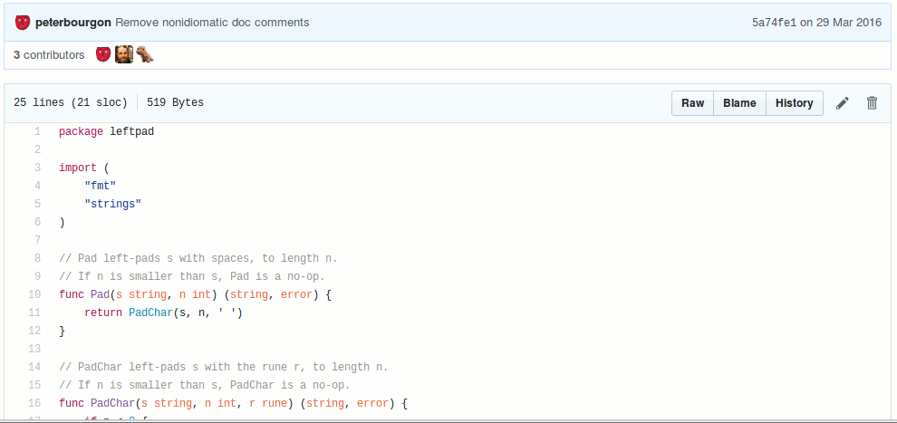

# Stylus Styles 用法

1. 安裝 Stylus [ [Firefox](https://addons.mozilla.org/en-US/firefox/addon/styl-us/) / [Chrome](https://chrome.google.com/webstore/detail/stylus/clngdbkpkpeebahjckkjfobafhncgmne) ]
2. 點擊圖示 > 管理已安裝 > 編寫新樣式
3. Mozilla 樣式 > 導入
4. 左邊輸入名稱後儲存

# List
| Name | Thumbnail |
| ---- | --------- |
| FaceBullshit |  |
| 動畫瘋 フレンズ |  |
| tab-size-on-github |  |
| Pixiv フレンズ |  |
| http-notifier |  |
