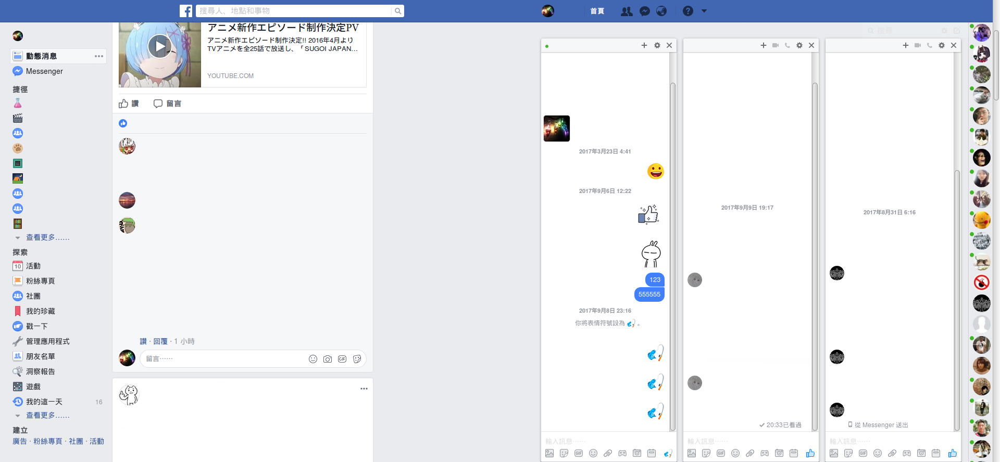
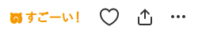
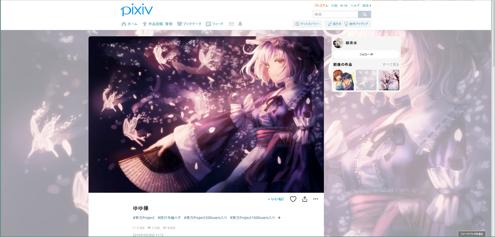
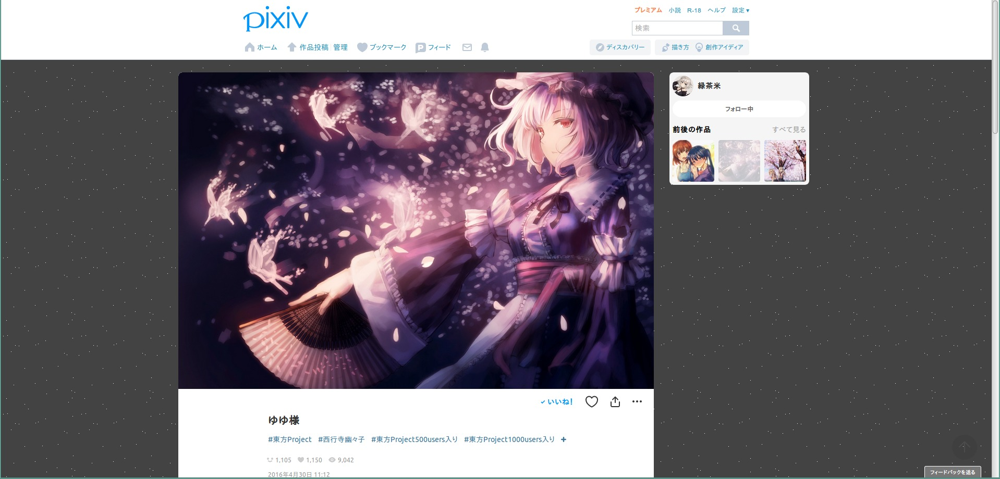
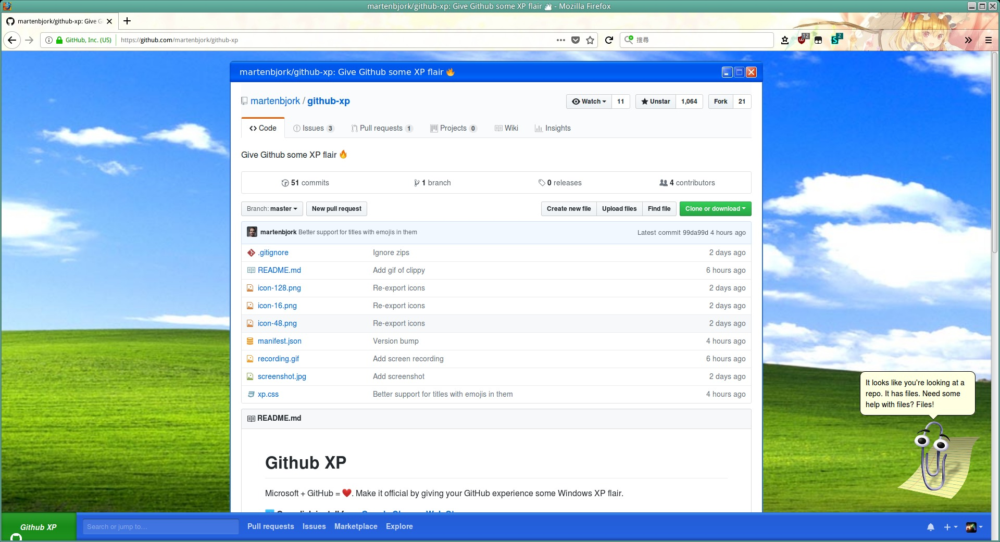
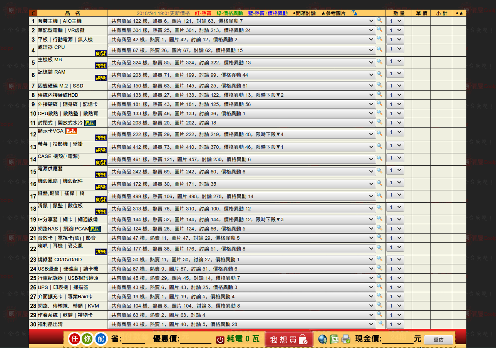
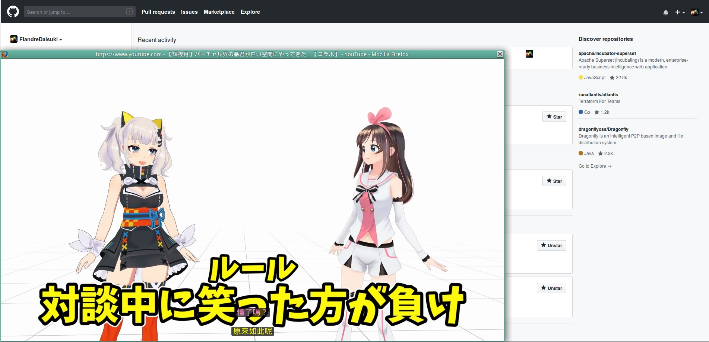

# UserCSS (The userstyle format of Stylus)

- [UserCSS (The userstyle format of Stylus)](#usercss-the-userstyle-format-of-stylus)
  - [使用+安裝方法](#使用安裝方法)
  - [列表](#列表)
    - [FaceBullshit](#facebullshit)
    - [Rotate FaceBullshit Indicator](#rotate-facebullshit-indicator)
    - [動畫瘋 フレンズ](#動畫瘋-フレンズ)
    - [動畫瘋 不要不要](#動畫瘋-不要不要)
    - [動畫瘋 獨立小窗模式](#動畫瘋-獨立小窗模式)
    - [pixiv フレンズ](#pixiv-フレンズ)
    - [pixiv 作品頁面新設計](#pixiv-作品頁面新設計)
    - [tab-size-on-github](#tab-size-on-github)
    - [github-xp](#github-xp)
    - [GitHub unfold](#github-unfold)
    - [Plurk 去廣告](#plurk-去廣告)
    - [原價屋估價頁](#原價屋估價頁)
    - [Right Click Save Images on Twitter](#right-click-save-images-on-twitter)
    - [Youtube 小窗](#youtube-小窗)

## 使用+安裝方法

1. 安裝 Stylus [ [Firefox](https://addons.mozilla.org/en-US/firefox/addon/styl-us/) / [Chrome](https://chrome.google.com/webstore/detail/stylus/clngdbkpkpeebahjckkjfobafhncgmne) ]
2. 點擊  安裝

有些樣式我有設定 CSS 選項，點  (或進入**管理已安裝樣式**界面)，樣式旁有齒輪圖示即表示有自訂選項

## 列表

### FaceBullshit

自己習慣的 FB 樣式，有開一些選項可自行調整

### Rotate FaceBullshit Indicator

Implement following [tweet](https://twitter.com/mrjacobbloom/status/1446651567772295169):

RotateFaceBullshitIndicator.mp4

### 動畫瘋 フレンズ

たーのしー！すごーい！

**No tatsuki, No tanoshi!**

### 動畫瘋 不要不要

不要新聞！不要彈幕！ (避免一點進頁面就被劇透)

### 動畫瘋 獨立小窗模式

主要搭配 popup 套件使用，讓小窗只顯示影片

1. [Popup Tab](https://addons.mozilla.org/firefox/addon/popup-tab/) (推薦)
2. [Popup window](https://addons.mozilla.org/firefox/addon/popup-window/)

### pixiv フレンズ

すごーい！君はイラストが上手いフレンズだね〜

### pixiv 作品頁面新設計

調整一些區塊位置、自訂背景跟一些字色，注意網址需要用單引號`'`夾起來

|x|預設|首頁樣式|
|:-:|:-:|:-:|
|預覽圖|  ||
|設定值| 背景種類: 圖片網址   背景色: #fff9  背景圖網址: `'https://i.imgur.com/V9wgOwA.jpg'`   背景圖大小: 延展不重複大圖   背景混成: color | 背景種類: 圖片網址   背景色: #00000000 (透明)  背景圖網址: `'https://s.pximg.net/common/images/bg/uchu01.jpg'`   背景圖大小: 原圖重複小圖 |

### tab-size-on-github

Modify your favorite tab size on GitHub

### github-xp

A userstyle version of [github-xp](https://github.com/martenbjork/github-xp)

### GitHub unfold

Unfold GitHub news in new UI

### Plurk 去廣告

隱藏貼文廣告、河道廣告、贊助貼文

### 原價屋估價頁

乾淨的原價屋估價頁

### Right Click Save Images on Twitter

["Right Click Save Images on Twitter"](https://greasyfork.org/scripts/20717) 的 usercss 版本

### Youtube 小窗

需搭配 [eight04/popup-tab](https://github.com/eight04/popup-tab) 及 [xxzefgh/youtube-classic-extension](https://github.com/xxzefgh/youtube-classic-extension) 取得最佳體驗

