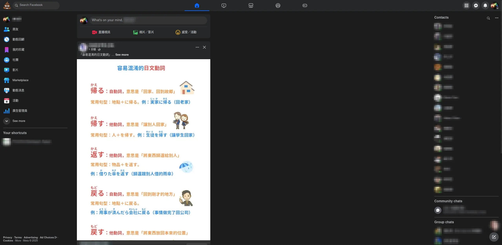

# UserCSS (The userstyle format of Stylus)

- [UserCSS (The userstyle format of Stylus)](#usercss-the-userstyle-format-of-stylus)
  - [使用+安裝方法](#使用安裝方法)
  - [列表](#列表)
    - [FaceBullshit](#facebullshit)
    - [Rotate FaceBullshit Indicator](#rotate-facebullshit-indicator)
    - [動畫瘋 不要不要](#動畫瘋-不要不要)
    - [動畫瘋 獨立小窗模式](#動畫瘋-獨立小窗模式)
    - [GitHub unfold](#github-unfold)
    - [Plurk 去廣告](#plurk-去廣告)
    - [原價屋估價頁](#原價屋估價頁)

## 使用+安裝方法

1. 安裝 Stylus [ [Firefox](https://addons.mozilla.org/en-US/firefox/addon/styl-us/) / [Chrome](https://chrome.google.com/webstore/detail/stylus/clngdbkpkpeebahjckkjfobafhncgmne) ]
2. 點擊  安裝

有些樣式我有設定 CSS 選項，點  (或進入**管理已安裝樣式**界面)，樣式旁有齒輪圖示即表示有自訂選項

## 列表

### FaceBullshit

自己習慣的 FB 樣式，有開一些選項可自行調整

  
截圖預覽

### Rotate FaceBullshit Indicator

Implement following [tweet](https://twitter.com/mrjacobbloom/status/1446651567772295169):

https://user-images.githubusercontent.com/5981459/136689428-4a102994-5080-4fc6-b714-3beb04aa5c09.mp4

### 動畫瘋 不要不要

不要新聞！不要彈幕！ (避免一點進頁面就被劇透)

### 動畫瘋 獨立小窗模式

主要搭配 popup 套件使用，讓小窗只顯示影片

1. [Popup Tab](https://addons.mozilla.org/firefox/addon/popup-tab/) (推薦)
2. [Popup window](https://addons.mozilla.org/firefox/addon/popup-window/)

### GitHub unfold

Unfold GitHub news in new UI

### Plurk 去廣告

隱藏貼文廣告、河道廣告、贊助貼文

### 原價屋估價頁

乾淨的原價屋估價頁

